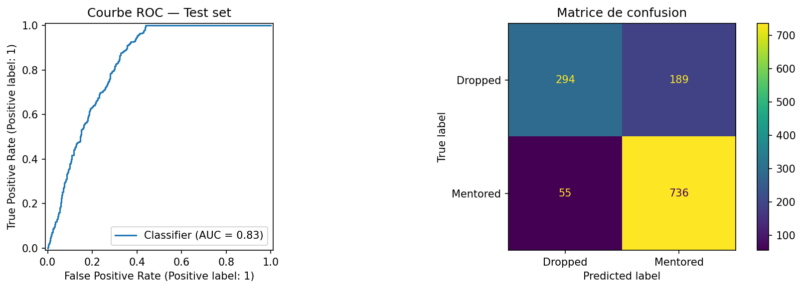
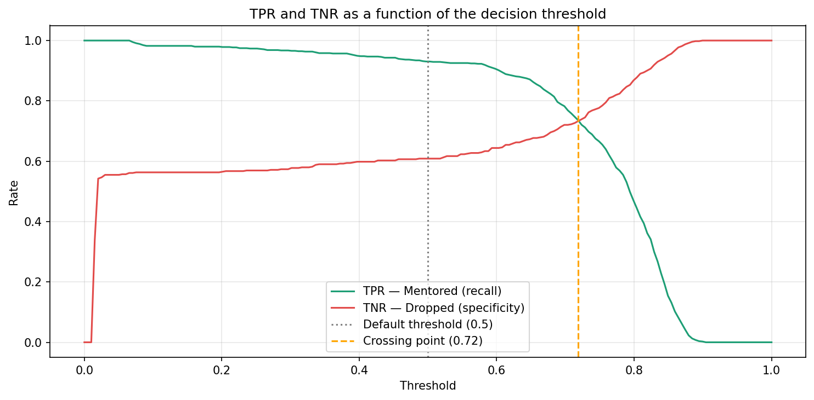
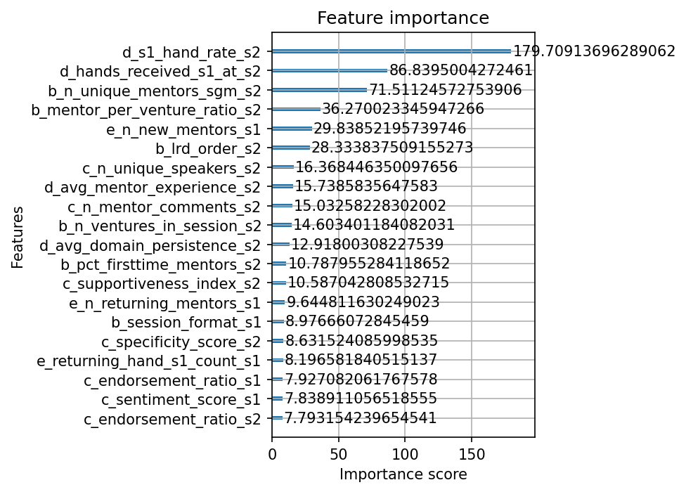

# CDL Mentorship Prediction Model

A machine learning pipeline predicting whether a startup venture will secure at least one mentor commitment ("hand raised") after Session 2, using historical program data from the Creative Destruction Lab (CDL). Built as a research project for HEC Paris (supervised by Prof. Thomas Astebro).

**Key results**: AUC-ROC 0.83. out-of-time (temporal) cross-validation. Bayesian Ridge imputation. 5 engineered feature blocks combining structured and NLP-derived signals (FinBERT). cost-sensitive decision threshold, improving specificity from 61% to 77% at the TPR/TNR crossing point.

## Problem Statement

**Can we predict, for a given venture, whether it will receive a mentorship commitment and make it through the first two sessions, or be dropped?**

- **Unit of analysis**: one row = one venture x one cohort year, with Session 1 and Session 2 features sitting side by side
- **Target**: `Y = 1` if the venture receives at least one hand raised after the LRD (Live Review & Discussion) in Session 1 or 2, `Y = 0` otherwise
- **Data**: 11 relational tables spanning 12 years of historical program data (8 tables used in this project), covering application data, venture-cohort information, session-level activity, mentor participation, and hand-raise outcomes

## Data Preprocessing

- **Out-of-time validation**: cohorts <= 2021/22 -> train, cohorts > 2021/22 -> test. A random split was rejected since the data is time-, cohort-, and network-dependent rather than i.i.d.
- **Missing values**: a missingness audit drops any column above a 50% missing-rate threshold; remaining values are imputed via multivariate Bayesian Ridge regression (`BayesianRidge` inside scikit-learn's `IterativeImputer`), which estimates each missing value conditional on all other features jointly.
- **Leakage control**: for tables indexed by mentor (no natural train/test split), features are computed by filtering to `Cohort_Year < current_venture_cohort_year` for each venture, enforcing the anti-leakage constraint at the feature-computation level rather than relying on the split alone.

## Feature Engineering

Five feature blocks, each following the same construction pattern (missingness audit -> BayesianRidge imputation -> feature construction):

| Block | Content |
|---|---|
| A | Static venture characteristics (application-level quality, sector, team) |
| B | SGM engagement features (mentor participation intensity, fit) |
| C | LRD discussion features (participation, objection/endorsement keyword ratios, FinBERT sentiment scoring) |
| D | Historical mentor behavior (mentor-level selectivity stats) |
| E | Network dynamics (co-raise clique signals, returning-mentor signals) |

Block C notably combines rule-based keyword lexicons (objection vs. endorsement terms) with a transformer-based sentiment model (`ProsusAI/finbert`) applied to discussion text.

## Modeling

**Why XGBoost over Logistic Regression / Random Forest:**

| | Logistic Regression | Random Forest | XGBoost |
|---|---|---|---|
| Requires scaling | Yes | No | No |
| Handles NaN natively | No | No | Yes |
| Captures non-linearities | No | Yes | Yes |
| Feature importance | No | Yes | Yes |
| Tunable regularization | Yes | Partial | Yes |

**Training pipeline:**
1. Class imbalance calibrated via `scale_pos_weight` (ratio of negative to positive class counts)
2. Optimal number of trees found via early stopping on a validation fold (up to 2,000 trees, stopped after 50 rounds without AUC improvement)
3. Hyperparameters tuned with `RandomizedSearchCV` (60 combinations, 5-fold stratified cross-validation, AUC-optimized)

## Results

- **AUC-ROC**: 0.83
- **Accuracy**: 81%
- **Recall (Mentored class)**: 93% at the default 0.5 threshold



```
=== FINAL RESULTS ===
AUC-ROC : 0.8277

              precision    recall  f1-score   support

     Dropped       0.84      0.61      0.71       483
    Mentored       0.80      0.93      0.86       791

    accuracy                           0.81      1274
   macro avg       0.82      0.77      0.78      1274
weighted avg       0.81      0.81      0.80      1274                  
```

**Cost-sensitive threshold selection**: TPR (recall on Mentored) and TNR (specificity on Dropped) were computed across all decision thresholds. The two curves cross around **0.72**, where the model trades recall on the Mentored class for a substantial gain in TNR (from 61% at the default 0.5 threshold to 77% at 0.72). This reflects the asymmetric cost structure of the problem : a false "Mentored" prediction (Type I error, false positive) commits program resources to a venture that will actually be dropped, while a false "Dropped" prediction (Type II error, false negative) is a lower-cost missed opportunity. The threshold was therefore selected to minimize the costlier error type rather than to maximize raw accuracy.



**Feature importance**: Session 2 features (`d_s1_hand_rate_s2`, `d_hands_received_s1_at_s2`, mentor engagement counts) dominate the top of the ranking.



## Limitations & Next Steps

The dominance of Session 2 features means the model largely **confirms** an outcome that is already emerging rather than **predicting** it early. The main lever for improvement is strengthening Session 1-only features to enable earlier, more actionable predictions. It is more a model of **nowcasting** rather than **forecasting**.

## Repository Structure

```
.
|-- src/
|   |-- load_data.py         # Load data from the excel files
|   |-- features_A.py        # Feature blocks A-E
|   |-- features_B.py   
|   |-- features_C.py
|   |-- features_D.py
|   |-- features_E.py
|   |-- build_features.py     # Assemble the 5 blocks for the final dataset
|   `-- model.py              # Training, tuning, evaluation, threshold analysis
|-- data/                     # Not included - confidential program data
|   |-- processed/
|   `-- raw/
|-- requirements.txt
`-- README.md
```

## Installation

```bash
git clone https://github.com/emmie-vinet/CDL_ml_model.git
cd CDL_ml_model
python -m venv venv
venv\Scripts\activate
pip install -r requirements.txt
```

## Note on data

Due to confidentiality constraints, raw CDL program data and exploratory notebooks are not included in this repository. The scripts reflect the full modeling logic and are adaptable to any dataset with a similar structure (feature matrix + binary target).


## Tech stack

- **Language**: Python
- **Modeling**: XGBoost, scikit-learn (`RandomizedSearchCV`, `IterativeImputer`, `BayesianRidge`)
- **Data manipulation**: pandas, numpy
- **NLP**: transformers (FinBERT sentiment scoring)
- **Visualization**: matplotlib